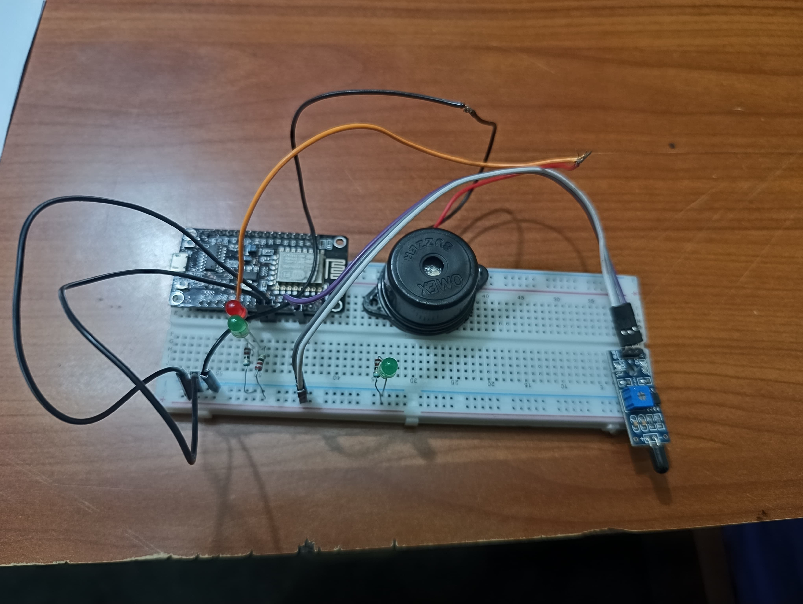

# Fire Alarm System using ESP8266

This is a real-time **Fire Alarm System** built with the **ESP8266** microcontroller. It utilizes a **flame sensor** to detect fire, and an **LED** and **buzzer** are activated in case of fire detection. It also has a web interface that shows the current status of the system.

### Web Interface Screenshot



## Features
- Detects fire using a **flame sensor**.
- Alerts via **LED** and **buzzer**.
- Web-based status display.
- **Wi-Fi** based system with **mDNS** support for easy access.

## Setup Instructions

### Hardware Requirements:
- **ESP8266** (e.g., NodeMCU, Wemos D1 Mini)
- **Flame Sensor**
- **LED**
- **Buzzer**
- **Jumper wires** and a **breadboard**.

### Software Requirements:
- **Arduino IDE**
  - Install the **ESP8266 Board** in the Arduino IDE through the Board Manager.
  - Install required libraries for **Wi-Fi** and **Web Server**.

### Steps to Run the System:

1. Clone the repository or download the project files.
2. Open the project in Arduino IDE (`sketch_apr21a.ino`).
3. Set up your **Wi-Fi credentials** in the code:
   ```cpp
   const char* ssid = "Your_SSID";
   const char* password = "Your_PASSWORD";
4. Select your **ESP8266 Board** and **Port**:
   - Go to **Tools > Board** and select your board (e.g., **NodeMCU 1.0 (ESP-12E Module)**).
   - Go to **Tools > Port** and select the correct port for your ESP8266.
5. Upload the code to your ESP8266 using the **Upload** button in the Arduino IDE.
6. Open the **Serial Monitor** in the Arduino IDE (set **Baud Rate to 115200**) to view the IP address assigned to your ESP8266.git add README.md assets/CircuitImage.jpg
git commit -m "Add web interface screenshot and update README with setup instructions"
git push origin main

7. Open your web browser and enter the displayed **IP address** to access the system's status page.
